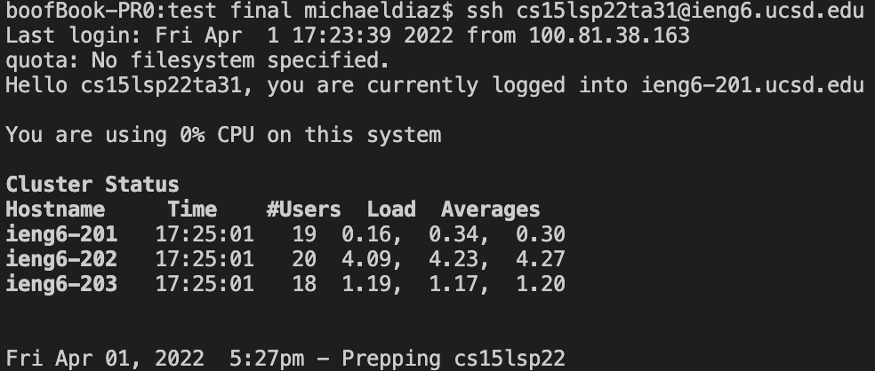

# Guide to Remote Access for CSE15L Students
## **Installing VScode**
Downloading VScode is as easy as visiting this [download link](https://code.visualstudio.com/download)! 
The link should bring you to a site that looks like the image below.

Click the download button for your respective software to start the download and follow the steps to download VScode on your machine.

## **Remotely Connecting**

### 1. Getting started with SSH

SSH is a program that allows us to access computers remotely from your own machine. MacOS automatically has SSH, so if you are on a Mac you can skip this step. 

However, for Windows, you can use this 
[sshdwnloadlink](https://docs.microsoft.com/en-us/windows-server/administration/openssh/openssh_install_firstuse) 
and follow the steps to get started with your download. 

### 2. SSH in VScode

In order to access SSH from VScode, open a new terminal. You can do this by using the ` key or by using 
Terminal &rarr; New Terminal in the dropdown menu options.

In the terminal, use the command  
`$ ssh cs15lsp22zz@ieng6.ucsd.edu` (but with your credentials)   in order to sign onto a computer remotely. 

If it is your first time logging onto a machine remotely, you may get a message stating   `Are you sure you want to continue connecting (yes/no/[fingerprint])?`  
Make sure to respond yes to these messages.

After logging in, you should see something like this:

## **Trying Some Commands**

### Great! Now that you've successfully connected to your remote machine, let's try playing with it. 

Some commands include `cd`, `ls`, `pwd`, `mkdir`, and `cp`. 

You can observe what each of these commands do, and come up with some ideas on how you might use these commands when working remotely. 

For example, below is one output from using the `cd` command.

You can see that what occurs is that the directory in the terminal changes from 4 to public.

## **Moving Files with `scp`**

### Now that we've tried some commands and are somewhat familiar with `scp`, let's try to move a file. 

First, create a file on your local machine. You can name this whatever you would like. Make sure to compile and save your file. 
Then use `scp (FILENAME HERE).java cs15lsp22zz@ieng6.ucsd.edu:~/` and enter your credentials to complete this step. It should look like this:

After that, log back into the remote machine and use `ls`. You should be able to see your file in the directory there.

## **Setting an SSH Key**

### Let's make this process easier using an SSH key.

SSH Keys can save you a ton of time when working remotely. To set up an SSH key, simply use the command `ssh-keygen` and follow the prompts. 

After you do this, logging into your account should look something like this:

## **Optimizing Remote Running**

### Now that we've optimized signing in, let's try to optimize signing in, changing a file, and saving it all at once.

Using SSH Keys can save you a lot of time when it comes to copying over and resaving a file remotely between two machines. Over 100 edits, it can save you almost two hours. 
