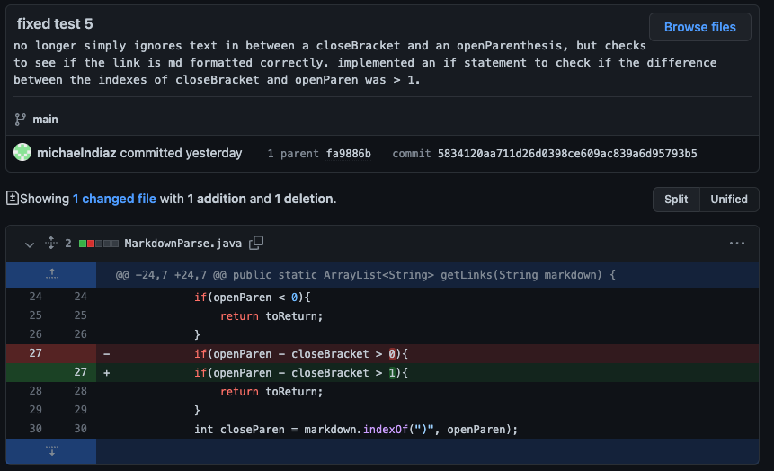
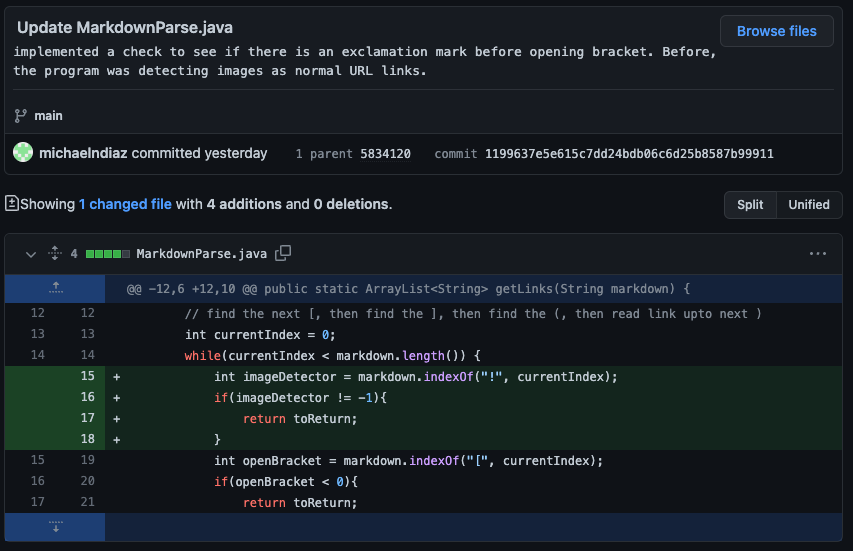

# ***BUGS!! BUGS EVERYWHERE!!***

## *First Attempt at fixing Gap Bug* 

The failure inducing input for this bug can be seen [here](./test-file5.md).

The symptom of this failure was that the program would ignore the gap betweeen the last closeBracket and openParen. This means that despite the fact that a link was formatted incorrectly in markdown, it would still be read as a link. Additionally, this first attempt at fixing this bug caused 4 symptoms in other test cases. 

The bug was that the code would not recognize that the format was incorrect. Due to this, the symptom was caused that the link was still read. As a result, the link was returned despite the fact that it should have been nothing returned. 

## *Second Attempt at fixing Gap Bug*

The failure inducing input for this bug can be seen [here](./test-file5.md).

The symptom of this failure-inducing input was that our program would ignore any words in between closeBracket and openParen. 

The bug was that our code simply recognized open and close bracket patterns, then would find the next open parenthesis and print the information between the open parenthesis and close parenthesis. This caused the symptom that incorrectly formatted links would still be printed. Therefore, the incorrectly formatted link in the failure-inducing input was still printed desptie the fact that it was not formatted correctly.

## *Fix for Image Link Bug*

The failure inducing input for this bug can be seen [here](./test-file6.md).

The symptom of this failure-inducing bug was that image links were read and printed like normal links.

The bug in our program was that there was no recognition of "!" symbols. This caused the symptom that image links would be read as normal link. Therefore, the failure-inducing input was read as a normal link rather than ignored as it is not a hyperlink.