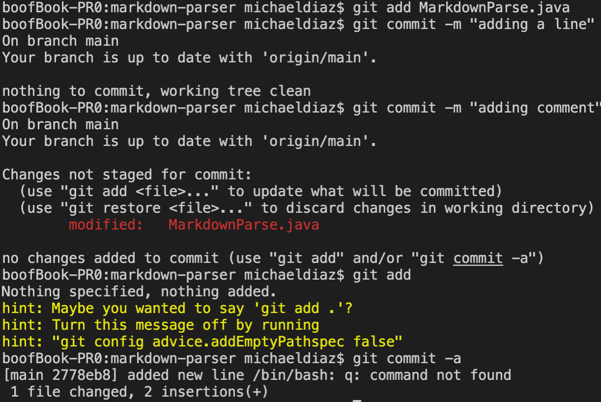

## Lab Report 3
### Streamlining ssh Configuration

This is my `.ssh/config` file. I used the command `nano config` to edit this directly in the terminal. The process was similar to `vim`.

Here is the command when used and you can see I was able to log into ssh using only `ssh ieng6`.

Here you can see I was able to copy the file to my account. Instead of the second classpath being super long, I was able to copy my file to the account using just `ieng6:~`.

### Setup Github Access from ieng6

Here, you can see the key stored in github that now enables me to `push` from terminal directly along with other `git` commands that were not possible before. The private key can be seen in the first command in this screenshot:

This screenshot shows me running `git` commands from my terminal in order to commit and push a change to Github. 

[Here](https://github.com/nidhidhamnani/markdown-parser/commit/2778eb8a8efb0b5914866b74dbcea06f9cb5cd6a) is the link to that commit.

### Copy whole directories with `scp -r`

This is what happened when I copied the entire directory to my `ieng6` account using `scp -r`. This process took a while due to the number of files in the test files folder.

Here, I ran the `make test` command and found this error.

In following screenshot, you can see how the entire directory was copied and subsequently, `make test` was run all by one command. The command used was `$ scp -r cs15lsp22ta44@ieng6.ucsd.edu:~markdown-parse;$ make test`. 

