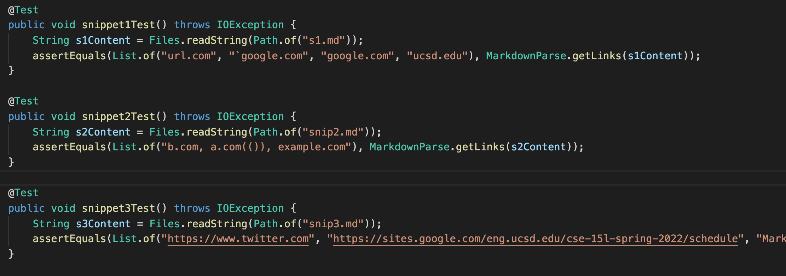
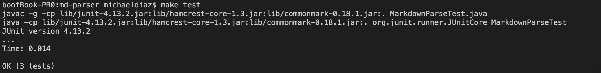
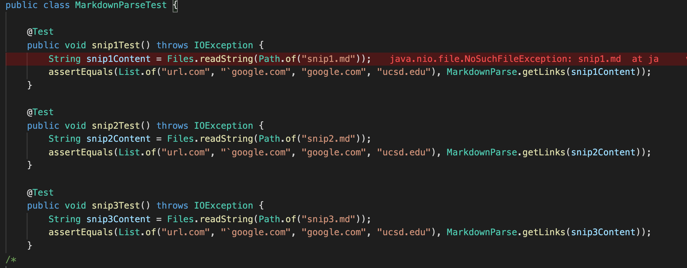
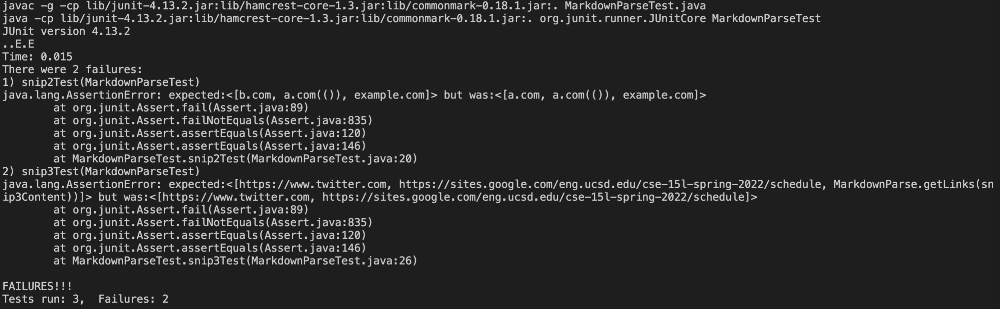

**My Implementation**

Here, we can see that all of the tests pass. I was able to do this by implementing everything that I talk about in the latter section of the report, including: recognition of nested links and ignoring of the parenthesis in nested links, as well as an if statement checking to see if there is a closing parenthesis or not before the next open bracket, and then if there is no open bracket, using a for loop to implement through the text file until the close parenthesis is found.
**Implementation from Week 7**

Here, we can see that two of the tests failed: the tests for snippet 2 and for snippet 3. 

Snippet 1 passes easily as it is the most straighforward. There are no nested links or line breaks that are unaccounted for in the code. 

For the test for snippet 2, the program is able to recognize the link is nested in the title of one of the links, but then is unable to recognize the link connected with that title. This could be fixed by adding code that allows the program to recognize special cases in which there are nested links. For example, if another open bracket is found then the program recognizes that the next open parenthesis should be ignored. 

For the test for snippet 3, it fails as the last link does not have a closing parenthesis for multiple line breaks. This is an easy fix and can likely be fixed by creating an if statement and foor loop to check if there is no close parenthesis, and if there is not then using the for loop to implement through lines until the close is found.